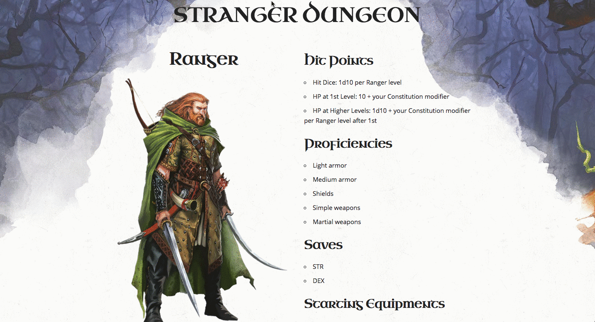

# [Stranger Dungeon](http://altabepha.com/strangerdungeon/)

Stranger Dungeon is a [Vue.js](https://vuejs.org/)-powered site that provides you with simple information on Dungeons & Dragons Classes.

## Disclaimer
- I have never played Dungeons & Dragons before, so I'm not really sure about which information is essential to be displayed, and about the rules of the game
- As to this, I'm trying to follow closely to what Beyond DnD has done in their [class description page](https://www.dndbeyond.com/characters/classes/barbarian)

## Brief
- On page refresh, randomly show 1 of the many D&D classes
- Display all other attributes related to the current class on the page
- On first page, show all classes at once and let users click on any class to their attributes ** *(bonus)* **
- Let users return back to the list page to see other class details ** *(bonus)* **

## Assumption
- The only API to be used is [http://www.dnd5eapi.co/](http://www.dnd5eapi.co/)
- The site needs to be mobile-responsive
- Provide a quick information of the DnD character class, full information will be redirected to a more comprehensive website
- API only provides text-basis information

## Used in this site
- [Vue.js](https://vuejs.org/) - as the primary web framework
- [Axios](https://github.com/axios/axios) - for promise-based AJAX call
- ~~[Lodash](https://lodash.com/) - for simple utility operation~~
- [Skeleton](http://getskeleton.com/) - as the primary css framework
- Images and artworks from various DnD fandom site, primarily [D&D Beyond](https://www.dndbeyond.com/)
- [vue-router 2](https://router.vuejs.org/en/) - for switching between two components

### Changelogs
- **5 Nov**
  - Basic site that displays random classes attributes randomly
  - Mobile-first site
- ** 14 Nov**
  - Class list page
  - Breaking down sites into 2 main components `Home` and `Details`
  - Implementation of `vue-router 2`
  - CSS updates
  - Additional features to scroll through classes using the right and left arrows
  - Removal of `lodash` as it is redundant 
